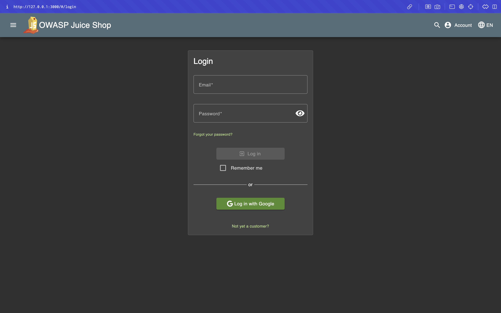
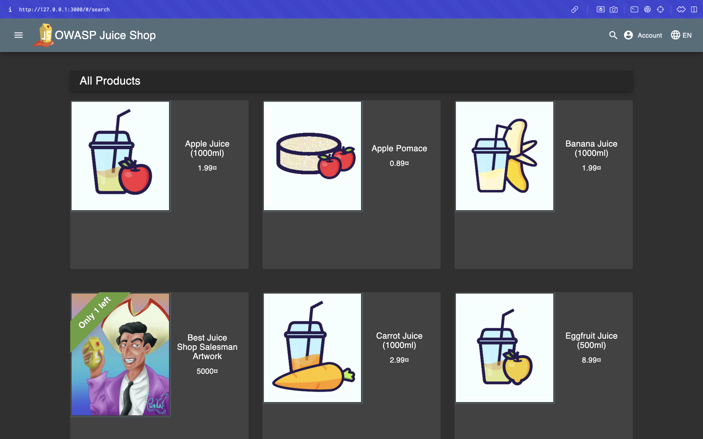
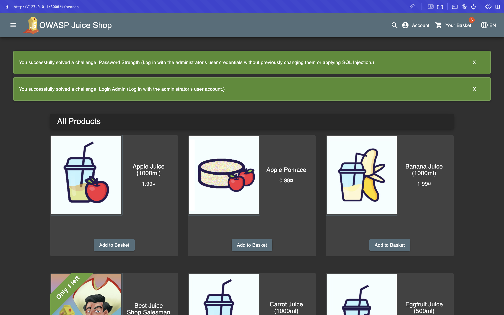

# Triage Report — OWASP Juice Shop

## Scope & Asset
- Asset: OWASP Juice Shop (local lab instance)
- Image: bkimminich/juice-shop:v19.0.0
- Release link/date: https://github.com/juice-shop/juice-shop/releases/tag/v19.0.0 — September 4, 2025
- Image digest (optional): <sha256:...>

## Environment
- Host OS: MacOS 15.5
- Docker: 27.4.0

## Deployment Details
- Run command used: `docker run -d --name juice-shop -p 127.0.0.1:3000:3000 bkimminich/juice-shop:v19.0.0`
- Access URL: http://127.0.0.1:3000
- Network exposure: 127.0.0.1 only [x] Yes  [ ] No  (explain if No)

## Health Check
- Page load: attach screenshot of home page (path or embed)
  [](./images1/homepage.png)
- API check: first 5–10 lines from `curl -s http://127.0.0.1:3000/rest/products | head`
  ```html
  <html>
  <head>
    <meta charset='utf-8'>
    <title>Error: Unexpected path: /rest/products</title>
    <style>* {
  margin: 0;
  padding: 0;
  outline: 0;
  }
    ```

## Surface Snapshot (Triage)
   - Login/Registration visible: [x] Yes  [ ] No — notes:
   [](./images1/login.png)
   - Product listing/search present: [x] Yes  [ ] No — notes:
   [](./images1/products.png)
   - Admin or account area discoverable: [x] Yes  [ ] No — notes:
From https://help.owasp-juice.shop/appendix/solutions.html
   [](./images1/admin.png)
   - Client-side errors in console: [ ] Yes  [x] No — notes: <...>
   - Security headers (quick look — optional): `curl -I http://127.0.0.1:3000` → CSP/HSTS present? notes:
   CSP/HSTS headers are missing
   ```
   HTTP/1.1 200 OK
Access-Control-Allow-Origin: *
X-Content-Type-Options: nosniff
X-Frame-Options: SAMEORIGIN
Feature-Policy: payment 'self'
X-Recruiting: /#/jobs
Accept-Ranges: bytes
Cache-Control: public, max-age=0
Last-Modified: Mon, 15 Sep 2025 18:00:51 GMT
ETag: W/"124fa-1994e8964c2"
Content-Type: text/html; charset=UTF-8
Content-Length: 75002
Vary: Accept-Encoding
Date: Mon, 15 Sep 2025 18:33:26 GMT
Connection: keep-alive
Keep-Alive: timeout=5
   ```

## Risks Observed (Top 3)
1. SQL injection during login. The server does not validate incoming data for SQL injections. It is possible to exploit this vulnerability and gain access to the administrator account
2. API routing issues - /rest/products returns 500 Internal Server Error (indicates a server problem, not the right response for missing routes), but the rest standard in this case provides a 404 Not Found code
3. Security headers - Not having a CSP means your site is vulnerable to cross-site scripting (XSS) attacks, letting attackers run malicious scripts on users’ browsers. Without HSTS, users can be tricked into using insecure HTTP connections, exposing them to man-in-the-middle attacks.

## Issues
- [Missing or weak security headers](https://github.com/MarkCesium/F25-DevSecOps-Intro/issues/1)
- [Admin account protection improvement](https://github.com/MarkCesium/F25-DevSecOps-Intro/issues/2)
- [Health check endpoint unreliable or behaves unexpectedly](https://github.com/MarkCesium/F25-DevSecOps-Intro/issues/3)