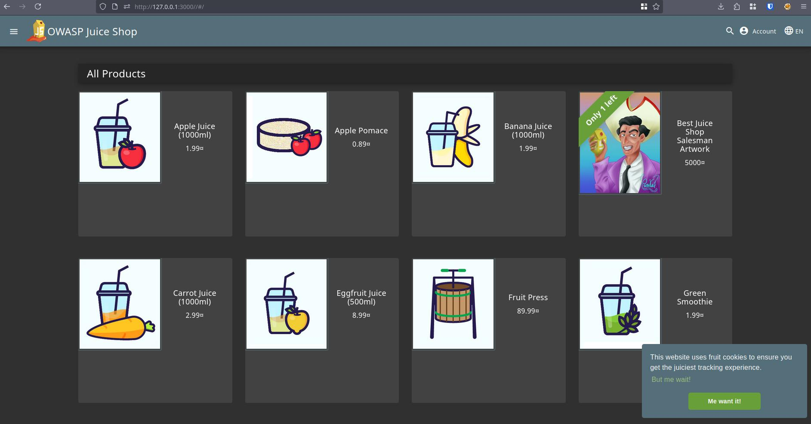

# Triage Report — OWASP Juice Shop

## Scope & Asset

- Asset: OWASP Juice Shop (local lab instance)
- Image: bkimminich/juice-shop:v19.0.0
- Release link/date: <https://hub.docker.com/layers/bkimminich/juice-shop/v19.0.0/images/sha256-547bd3fef4a6d7e25e131da68f454e6dc4a59d281f8793df6853e6796c9bbf58>
- Image digest (optional): sha256:2765a26de7647609099a338d5b7f61085d95903c8703bb70f03fcc4b12f0818d

## Environment

- Host OS: Arch Linux (Linux kernel version: 6.16.8)
- Docker: Docker API version: 1.51, Docker client version: 28.4.0

## Deployment Details

- Run command used: `docker run -d --name juice-shop -p 127.0.0.1:3000:3000 bkimminich/juice-shop:v19.0.0`
- Access URL: <http://127.0.0.1:3000>
- Network exposure: 127.0.0.1 only [x] Yes  [ ] No  (explain if No)

## Health Check

- Page load:


- API check: first 5–10 lines from `curl -s http://127.0.0.1:3000/rest/products | head`

```html
<html>
  <head>
    <meta charset='utf-8'>
    <title>Error: Unexpected path: /rest/products</title>
    <style>* {
  margin: 0;
  padding: 0;
  outline: 0;
}
```

## Surface Snapshot (Triage)

- Login/Registration visible: [x] Yes  [ ] No - notes: Registration requires minimal password length of 5 characters
- Product listing/search present: [x] Yes  [ ] No
- Admin or account area discoverable: [x] Yes  [ ] No — notes: Admin and account areas can be found by examining frontend source code (file `main.js`).
- Client-side errors in console: [ ] Yes  [x] No
- Security headers (quick look — optional): `curl -I http://127.0.0.1:3000` → CSP/HSTS present? notes: No CSP or HSTS are present. The Access-Control-Allow-Origin allows all origins.

## Risks Observed (Top 3)

1) Risk of malicious API calls on behalf of authenticated user from other websites. This can happen because of too broad Access-Control-Allow-Oirigin, which enables other sites to do request from client side to the application.
2) Risk of content/script injection. Absence of CSP headers or meta tags leads to weakened security state, which makes XSS attacks more dangerous.
3) Risk of password attacks. As the password policy is not strict enough, attackers may utilize this knowledge to perform password spray, password bruteforce (as the website lacks bruteforce protection).
