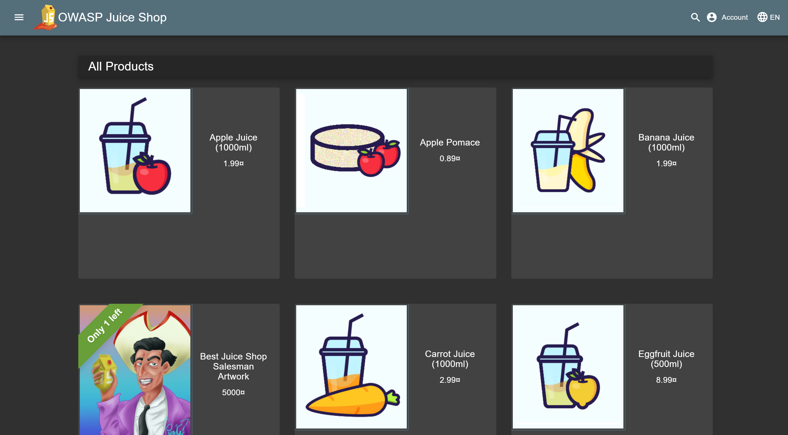
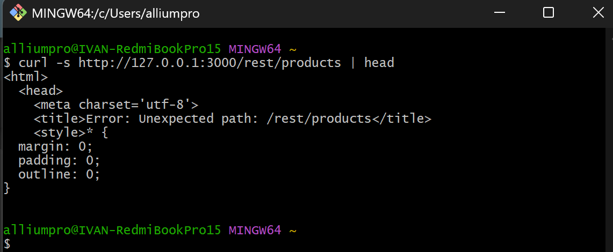

# Triage Report — OWASP Juice Shop

## Scope & Asset
- Asset: OWASP Juice Shop (local lab instance)
- Image: bkimminich/juice-shop:19.0.0
- Release link/date: <https://github.com/juice-shop/juice-shop/releases/tag/v19.0.0> — <Sep 4, 2025>

## Environment
- Host OS: <Windows 11 Pro 24H2>
- Docker: <28.0.4>

## Deployment Details
- Run command used: `docker run -d --name juice-shop -p 127.0.0.1:3000:3000 bkimminich/juice-shop`
- Access URL: http://127.0.0.1:3000
- Network exposure: 127.0.0.1 only [x] Yes  [ ] No  (explain if No)

## Health Check
- Page load: attach screenshot of home page (path or embed)
  
- API check: first 5–10 lines from `curl -s http://127.0.0.1:3000/rest/products | head`
  

## Surface Snapshot (Triage)
- Login/Registration visible: [x] Yes  [ ] No — notes: <The registration\Login forms are visible.>
- Product listing/search present: [x] Yes  [ ] No — notes: <Products are visible and search works.>
- Admin or account area discoverable: [x] Yes  [ ] No — notes: <Admin area is undiscoverable for a user, account area is visible and accessible.>
- Client-side errors in console: [ ] Yes  [x] No — notes: <No visible errors in console were met for most of the operations.>

## Risks Observed (Top 3)
1) DOM XSS attack vulnerability - The search form probably uses innerHTML in JS and it can be used to insert malicious scripts in the website - [Issue](https://github.com/AlliumPro/F25-DevSecOps-Intro/issues/1)
2) Zero-star Review sent - The submit button on feedback page can be enabled by removing some attributes in the buttons html markup - [Issue](https://github.com/AlliumPro/F25-DevSecOps-Intro/issues/2)
3) Exposed metrics - Prometheus provides a 'metrics' endpoint which is not secured - [Issue](https://github.com/AlliumPro/F25-DevSecOps-Intro/issues/3)
