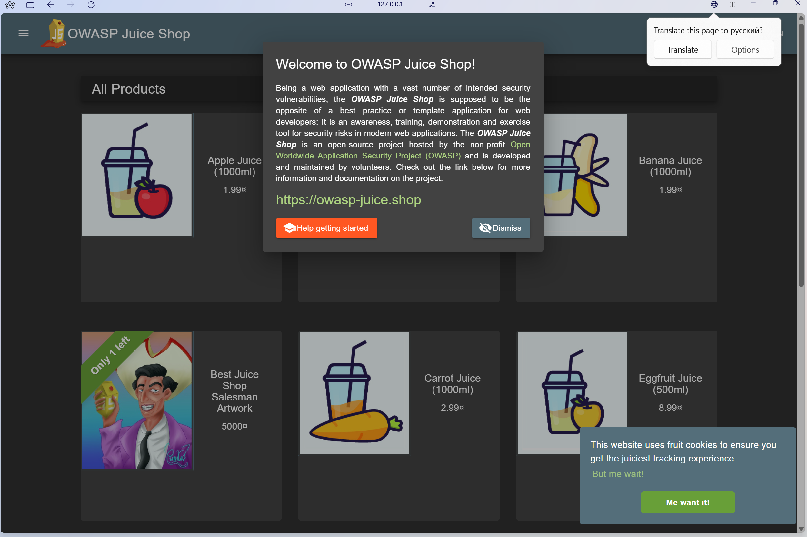

# Triage Report — OWASP Juice Shop

## Scope & Asset
- Asset: OWASP Juice Shop (local lab instance)
- Image: bkimminich/juice-shop:19.0.0
- Release https://github.com/juice-shop/juice-shop/releases/tag/v19.0.0 - 04 Sep 2025
- Image digest (optional): sha256:2765a26de7647609099a338d5b7f61085d95903c8703bb70f03fcc4b12f0818d

## Environment
- Host OS: Ubuntu 22.04 (WSL)
- Docker: Docker version 27.5.1, build 27.5.1-0ubuntu3~24.04.2

## Deployment Details
- Run command used: `docker run -d --name juice-shop -p 127.0.0.1:3000:3000 bkimminich/juice-shop:19.0.0`
- Access URL: http://127.0.0.1:3000
- Network exposure: 127.0.0.1 only [x] Yes  [ ] No  (explain if No)

## Health Check
- Page load: attach screenshot of home page (path or embed)

- Page load:  
  

- API check: first 5–10 lines from `curl -s http://127.0.0.1:3000/rest/products | head`

```
  <html>
  <head>
    <meta charset='utf-8'>
    <title>Error: Unexpected path: /rest/products</title>
    <style>* {
  margin: 0;
  padding: 0;
  outline: 0;
  }
```

## Surface Snapshot (Triage)
- Login/Registration visible: [x] Yes  [ ] No — notes: buttons on the main page.
- Product listing/search present: [x] Yes  [ ] No — notes: visible on the landing page.
- Admin or account area discoverable: [x] Yes  [ ] No — notes: Possibly, account menu is visible; admin routes may be guessable.
- Client-side errors in console: [ ] Yes  [x] No 
- Security headers (quick look — optional): `curl -I http://127.0.0.1:3000` → CSP/HSTS present? notes: 
```
HTTP/1.1 200 OK
Access-Control-Allow-Origin: *
X-Content-Type-Options: nosniff
X-Frame-Options: SAMEORIGIN
Feature-Policy: payment 'self'
X-Recruiting: /#/jobs
Accept-Ranges: bytes
Cache-Control: public, max-age=0
Last-Modified: Thu, 11 Sep 2025 17:56:07 GMT
ETag: W/"124fa-19939eba27d"
Content-Type: text/html; charset=UTF-8
Content-Length: 75002
Vary: Accept-Encoding
Date: Thu, 11 Sep 2025 17:57:16 GMT
Connection: keep-alive
Keep-Alive: timeout=5
```

No Content-Security-Policy (CSP), No HSTS.

## Risks Observed (Top 3)

1) Overly permissive CORS — Access-Control-Allow-Origin: * allows any domain, raising risk of XSS/data theft.

2) Missing key security headers — no CSP and no HSTS, leaving the app exposed to script injection and MITM attacks.

3) Unauthenticated surface — product catalog and login/register endpoints visible without authentication, increasing attack surface.

# Issues

---
* https://github.com/EmilGoryachih/F25-DevSecOps-Intro/issues/4
* https://github.com/EmilGoryachih/F25-DevSecOps-Intro/issues/3
* https://github.com/EmilGoryachih/F25-DevSecOps-Intro/issues/2
* https://github.com/EmilGoryachih/F25-DevSecOps-Intro/issues/1
