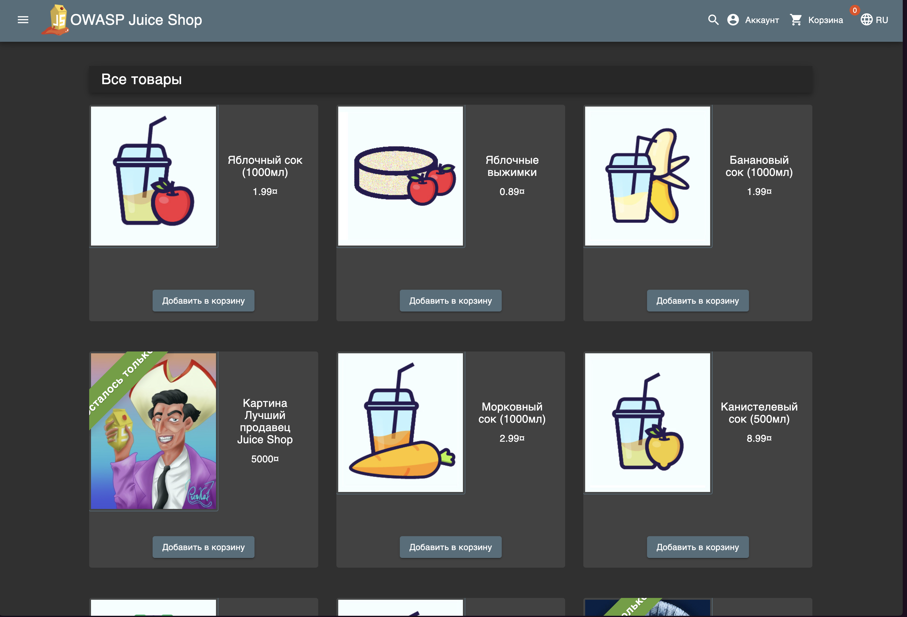

# Triage Report — OWASP Juice Shop

## Scope & Asset
- Asset: OWASP Juice Shop (local lab instance)
- Image: bkimminich/juice-shop:19.0.0
- Release link/date: https://github.com/juice-shop/juice-shop/releases/tag/v19.0.0 — September 4, 2025
- Image digest (optional): <sha256:...>

## Environment
- Host OS: macOS 15.6.1
- Docker: 28.4.0

## Deployment Details
- Run command used: docker run -d --name juice-shop -p 127.0.0.1:3000:3000 bkimminich/juice-shop:19.0.0
- Access URL: http://127.0.0.1:3000
- Network exposure: 127.0.0.1 only [x] Yes  [ ] No  (explain if No)

## Health Check
- Page load: 
- API check: first 5–10 lines from curl -s http://127.0.0.1:3000/rest/products | head
<html>
  <head>
    <meta charset='utf-8'> 
    <title>Error: Unexpected path: /rest/products</title>
    <style>* {
  margin: 0;
  padding: 0;
  outline: 0;
}
## Surface Snapshot (Triage)
- Login/Registration visible: [x] Yes  [ ] No — notes: the top menu contains a button that takes you to the login page.
- Product listing/search present: [x] Yes  [ ] No — notes: <...>
- Admin or account area discoverable: [x] Yes  [ ] No — notes: <...> Use SQL injection
- Client-side errors in console: [x] Yes  [ ] No — notes: error when adding a product to the basket multiple times
- Security headers (quick look — optional): curl -I http://127.0.0.1:3000 → CSP/HSTS present? notes: X-Content-Type-Options, X-Frame-Options, Access-Control-Allow-Origin

## Risks Observed (Top 3)
1) SQL Injection — input fields such as search and login allow SQL queries to be injected, which can lead to data leakage.  
2) Cross-Site Scripting (XSS) — the application does not filter user input, allowing malicious JavaScript to be injected.  
3)  Broken Access Control — access to administrative functions is possible without proper authorization, which violates the security model.

##Issues
1) SQL Injections ![https://github.com/Uiyrte/F25-DevSecOps-Intro/issues/1]
2) Cross-Site Scripting (XSS)![https://github.com/Uiyrte/F25-DevSecOps-Intro/issues/2]
3) Broken Access Control ![https://github.com/Uiyrte/F25-DevSecOps-Intro/issues/3]