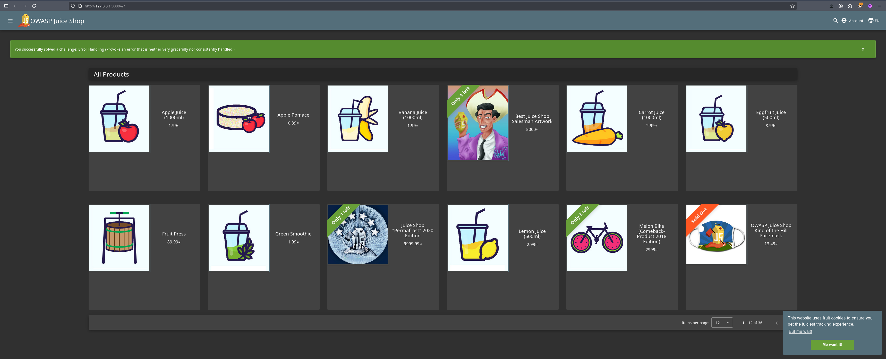

# Triage Report — OWASP Juice Shop

## Scope & Asset

* Asset: OWASP Juice Shop (local lab instance)
* Image: bkimminich/juice-shop:19.0.0
* Release link/date: [https://github.com/juice-shop/juice-shop/releases/tag/v19.0.0](https://github.com/juice-shop/juice-shop/releases/tag/v19.0.0) — 2025-09-07

## Environment

* Host OS: Linux r3taker-pc 6.15.6-arch1-1 #1 SMP PREEMPT_DYNAMIC Thu, 10 Jul 2025 17:10:18 +0000 x86_64 GNU/Linux
* Docker: Docker version 28.3.0, build 38b7060a21

## Deployment Details

* Run command used: `docker run -d --name juice-shop -p 127.0.0.1:3000:3000 bkimminich/juice-shop:19.0.0`
* Access URL: [http://127.0.0.1:3000](http://127.0.0.1:3000)
* Network exposure: 127.0.0.1 only [x] Yes  [ ] No  (приложение слушает локальный интерфейс)

## Health Check

* Page load: 


* API check: first 5–10 lines from `curl -s http://127.0.0.1:3000/rest/products | head`

```html
<html>
  <head>
    <meta charset='utf-8'> 
    <title>Error: Unexpected path: /rest/products</title>
    <style>* {
  margin: 0;
  padding: 0;
```

## Surface Snapshot (Triage)

* Login/Registration visible: \[x] Yes  \[ ] No — notes: кнопка входа/регистрации доступна на UI
* Product listing/search present: \[x] Yes  \[ ] No — notes: витрина товаров и поиск видны на главной странице
* Admin or account area discoverable: \[x] Yes  \[ ] No — notes: навигация к аккаунту доступна в интерфейсе
* Client-side errors in console: \[x] Yes  \[] No — notes: при первичной проверке в консоли была ошибка SES Removing unpermitted intrinsics
* Security headers (quick look — optional): `curl -I http://127.0.0.1:3000` → CSP/HSTS present? No. notes:

  ```
  HTTP/1.1 200 OK
  Access-Control-Allow-Origin: *
  X-Content-Type-Options: nosniff
  X-Frame-Options: SAMEORIGIN
  Feature-Policy: payment 'self'
  ...
  ```

  Комментарий: присутствуют `X-Content-Type-Options` и `X-Frame-Options`, но отсутствуют `Content-Security-Policy` и `Strict-Transport-Security`.

## Risks Observed (Top 3)

1. Cross-Site Scripting (XSS) — отсутствие CSP и наличие пользовательского ввода (поиск, формы) повышает риск исполнения произвольного JavaScript.
2. Verbose authentication errors / информационная утечка — при попытке вызвать защищённый endpoint с неверным токеном возвращается информативное сообщение (`Invalid token: no header in signature 'dummy-token'`), что даёт подсказки атакующему.
3. Недостаток строгих security headers (отсутствие CSP/HSTS) — увеличивает поверхность для XSS и MITM-атак; рекомендуется добавить CSP, HSTS и другие заголовки.
