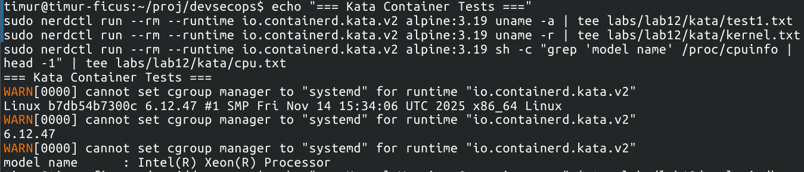
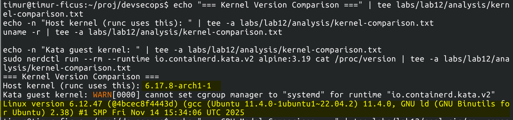

# Task 1

Before I could execute `sudo nerdctl run --rm --runtime io.containerd.kata.v2 alpine:3.19 uname -a`, I had to install
CNI plugins from https://github.com/containernetworking/plugins/releases into a new directory `/opt/cni/bin`, as
demanded by an error message.

### Shim

`containerd-shim-kata-v2 --version` gives:
```text
Kata Containers containerd shim (Rust): id: io.containerd.kata.v2, version: 3.23.0, commit: 89cd5613401a9585d023fce2534c13d9f79d9f2d
```

### Test run

The suggested testing command `sudo nerdctl run --rm --runtime io.containerd.kata.v2 alpine:3.19 uname -a` gives:
```text
WARN[0000] cannot set cgroup manager to "systemd" for runtime "io.containerd.kata.v2" 
Linux bfa9e798b37d 6.12.47 #1 SMP Fri Nov 14 15:34:06 UTC 2025 x86_64 Linux
```

I decided to try and run `nginx` in this way:
```bash
sudo nerdctl run --rm --runtime io.containerd.kata.v2 -p 80:80 nginx
```

Output:
```text
docker.io/library/nginx:latest:                                                   resolved       |++++++++++++++++++++++++++++++++++++++| 
index-sha256:553f64aecdc31b5bf944521731cd70e35da4faed96b2b7548a3d8e2598c52a42:    done           |++++++++++++++++++++++++++++++++++++++| 
manifest-sha256:5c733364e9a8f7e6d7289ceaad623c6600479fe95c3ab5534f07bfd7416d9541: done           |++++++++++++++++++++++++++++++++++++++| 
config-sha256:60adc2e137e757418d4d771822fa3b3f5d3b4ad58ef2385d200c9ee78375b6d5:   done           |++++++++++++++++++++++++++++++++++++++| 
layer-sha256:de57a609c9d5148f10b38f5c920d276e9e38b2856fe16c0aae1450613dc12051:    done           |++++++++++++++++++++++++++++++++++++++| 
layer-sha256:108ab82928207dabd9abfddbc960dd842364037563fc560b8f6304e4a91454fe:    done           |++++++++++++++++++++++++++++++++++++++| 
layer-sha256:77fa2eb0631772679b0e48eca04f4906fba5fe94377e01618873a4a1171107ce:    done           |++++++++++++++++++++++++++++++++++++++| 
layer-sha256:192e2451f8751fb74549c932e26a9bcfd7b669fe2f5bd8381ea5ac65f09b256b:    done           |++++++++++++++++++++++++++++++++++++++| 
layer-sha256:0e4bc2bd6656e6e004e3c749af70e5650bac2258243eb0949dea51cb8b7863db:    done           |++++++++++++++++++++++++++++++++++++++| 
layer-sha256:53d743880af45adf9f141eec1fe3a413087e528075a5d8884d6215ddfdd2b806:    done           |++++++++++++++++++++++++++++++++++++++| 
layer-sha256:b5feb73171bf1bcf29fdd1ba642c3d30cdf4c6329b19d89be14d209d778c89ba:    done           |++++++++++++++++++++++++++++++++++++++| 
elapsed: 12.3s                                                                    total:  57.0 M (4.6 MiB/s)                                       
WARN[0012] cannot set cgroup manager to "systemd" for runtime "io.containerd.kata.v2" 
/docker-entrypoint.sh: /docker-entrypoint.d/ is not empty, will attempt to perform configuration
/docker-entrypoint.sh: Looking for shell scripts in /docker-entrypoint.d/
/docker-entrypoint.sh: Launching /docker-entrypoint.d/10-listen-on-ipv6-by-default.sh
10-listen-on-ipv6-by-default.sh: info: Getting the checksum of /etc/nginx/conf.d/default.conf
10-listen-on-ipv6-by-default.sh: info: Enabled listen on IPv6 in /etc/nginx/conf.d/default.conf
/docker-entrypoint.sh: Sourcing /docker-entrypoint.d/15-local-resolvers.envsh
/docker-entrypoint.sh: Launching /docker-entrypoint.d/20-envsubst-on-templates.sh
/docker-entrypoint.sh: Launching /docker-entrypoint.d/30-tune-worker-processes.sh
/docker-entrypoint.sh: Configuration complete; ready for start up
2025/11/20 12:47:38 [notice] 1#1: using the "epoll" event method
2025/11/20 12:47:38 [notice] 1#1: nginx/1.29.3
2025/11/20 12:47:38 [notice] 1#1: built by gcc 14.2.0 (Debian 14.2.0-19) 
2025/11/20 12:47:38 [notice] 1#1: OS: Linux 6.12.47
2025/11/20 12:47:38 [notice] 1#1: getrlimit(RLIMIT_NOFILE): 1048576:1048576
2025/11/20 12:47:38 [notice] 1#1: start worker processes
2025/11/20 12:47:38 [notice] 1#1: start worker process 24
10.4.0.1 - - [20/Nov/2025:12:47:50 +0000] "GET / HTTP/1.1" 200 615 "-" "curl/8.17.0" "-"
^C2025/11/20 12:48:15 [notice] 1#1: signal 2 (SIGINT) received, exiting
2025/11/20 12:48:15 [notice] 24#24: exiting
2025/11/20 12:48:15 [notice] 24#24: exit
2025/11/20 12:48:15 [notice] 1#1: signal 2 (SIGINT) received, exiting
2025/11/20 12:48:15 [notice] 24#24: signal 2 (SIGINT) received, exiting
2025/11/20 12:48:15 [notice] 1#1: signal 17 (SIGCHLD) received from 24
2025/11/20 12:48:15 [notice] 1#1: worker process 24 exited with code 0
2025/11/20 12:48:15 [notice] 1#1: exit
```

Here is what `curl localhost:80` prints:
```html
<!DOCTYPE html>
<html>
<head>
<title>Welcome to nginx!</title>
<style>
html { color-scheme: light dark; }
body { width: 35em; margin: 0 auto;
font-family: Tahoma, Verdana, Arial, sans-serif; }
</style>
</head>
<body>
<h1>Welcome to nginx!</h1>
<p>If you see this page, the nginx web server is successfully installed and
working. Further configuration is required.</p>

<p>For online documentation and support please refer to
<a href="http://nginx.org/">nginx.org</a>.<br/>
Commercial support is available at
<a href="http://nginx.com/">nginx.com</a>.</p>

<p><em>Thank you for using nginx.</em></p>
</body>
</html>
```

# Task 2

### Juice-runc health check

`curl -s -o /dev/null -w "juice-runc: HTTP %{http_code}\n" http://localhost:3012` prints response code 200 (see
`labs/lab12/runc/health.txt`)

### Showing Kata containers run successfully with `--runtime io.containerd.kata.v2`

Here is a screenshot:



### Kernel versions comparison

Here is a screenshot with kernel versions highlighted (check `labs/submission12/Task2-kernel-versions.png` for the
unedited version):



Here we can see that the host kernel is more up-to-date than the guest one.

### CPU models comparison

As seen in the report file `labs/lab12/analysis/cpu-comparison.txt`, my real CPU is exactly an Intel Core i5-1240P.
However, from within the container, it shows up as `Intel(R) Xeon(R) Processor`, even without a concrete version.

### Isolation implications

- **runc**: Weak isolation, many ways for the process to see the host environment. Less security.
- **Kata**: Strong isolation, process is running on a virtual machine that hides the host. More secure.

# Task 3

### `dmesg` output differences

As seen in `labs/lab12/isolation/dmesg.txt`, Kata does indeed start a separate virtual machine to run the process
inside of.

### `/proc` filesystem visibility

There were 392 processes running on my laptop at the time of running the commands. Inside a Kata VM, there are only 52
processes visible, and even these are internal to the virtual machine, so the container's process space is isolated.

### Network interfaces

The Kata VM only has 2 interfaces (one of which is the loopback), which is the bare minimum (otherwise there would be no
internet connection inside the VM). See `labs/lab12/isolation/network.txt`.

### Kernel module counts

The host has 340 kernel modules loaded, but the VM only has 72 loaded.

### Isolation boundary differences

- **runc**: namespace-based isolation, can potentially see memory/cpu resources, files, or network of the host system.
- **kata**: uses virtual machines, the containerized app cannot see anything at all outside of its virtual machine.

### Security implications of container escape

- Container escape in `runc` = access to the host machine.
- Container escape in Kata = loss of one instance of the Kata virtual machine; nothing critical.

# Task 4

### Startup times

Because I use the `bash` shell, in which `time` is a built-in, I had to change the suggested command to

```bash
echo "=== Startup Time Comparison ===" | tee labs/lab12/bench/startup.txt

echo "runc:" | tee -a labs/lab12/bench/startup.txt
/usr/bin/time -p sudo nerdctl run --rm alpine:3.19 echo "test" 2>&1 | grep real | tee -a labs/lab12/bench/startup.txt

echo "Kata:" | tee -a labs/lab12/bench/startup.txt
/usr/bin/time -p sudo nerdctl run --rm --runtime io.containerd.kata.v2 alpine:3.19 echo "test" 2>&1 | grep real | tee -a labs/lab12/bench/startup.txt
```

(`time` -> `/usr/bin/time -p`).

`runc` executes in about half a second, and Kata finishes on my laptop in almost 7 seconds (see
`labs/lab12/bench/startup`).

### runc HTTP latency

It is 2.6ms on average (see `labs/lab12/bench/http-latency.txt`).

### Performance tradeoffs

- **Startup overhead**: Kata takes 14x longer than `runc`.
- **Runtime overhead**: There is no data, but it is reasonable to expect that Kata needs more resources because it has
to emulate the behavior of a machine.
- **CPU overhead**: There is no data, but it is reasonable to expect that Kata needs more resources because it has
to emulate the behavior of a machine.

### When to use what

- **Use runc when**: low risk of container escape, or performance is important.
- **Use Kata when**: high risk of attack, or the app is untrusted.

