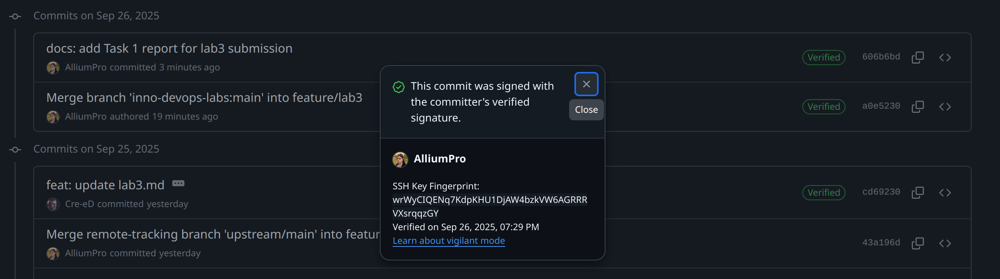
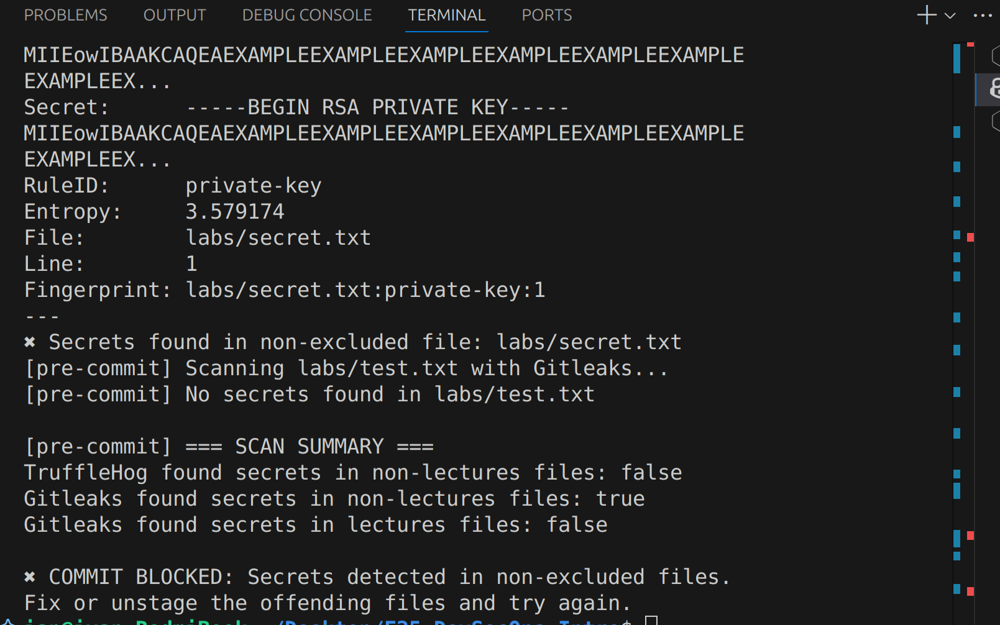
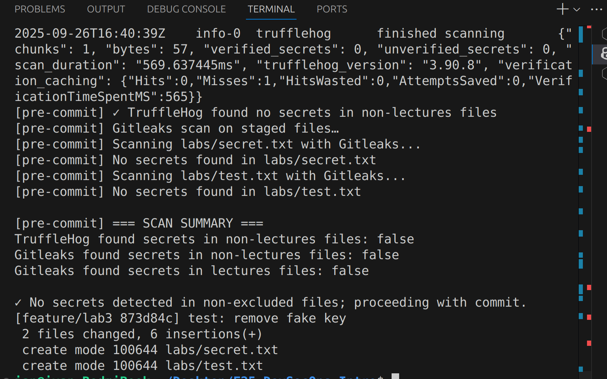

# Lab 3 — Secure Git Submission

## Task 1: SSH Commit Signature Verification

### 1. Summary: Benefits of Signing Commits for Security

Signing commits ensures that every change in the repository can be traced to a verified author. This prevents unauthorized or malicious changes, protects the integrity, and builds trust. Signed commits also help organizations maintain accountability.

### 2. Evidence of Successful SSH Key Setup and Configuration

SSH key was generated and configured for commit signing:

```bash
ssh-keygen -t ed25519 -C "vanya.murzin@inbox.ru"
git config --global user.signingkey ~/.ssh/id_ed25519.pub
git config --global commit.gpgSign true
git config --global gpg.format ssh
```

The SSH key already existed and was reused for signing. I used Git and configured it to use this key for commit signatures.

### 3. Analysis: Why is Commit Signing Critical in DevSecOps Workflows?

Commit signing is essential in DevSecOps because it enforces code provenance and accountability. It ensures that only authorized contributors can make changes, and every commit can be cryptographically verified. This reduces the risk of supply chain attacks, unauthorized code injections, and helps with compliance and audit requirements.

### 4. Verification: "Verified" Badge on GitHub



## Task 2: Pre-commit Secret Scanning

### 1. Pre-commit Hook Setup and Configuration

A pre-commit hook was added to `.git/hooks/pre-commit` to automatically scan staged files for secrets using. The script blocks commits if secrets are found outside the lectures directory.

### 2. Evidence of Successful Secret Detection Blocking Commits

A test secret was added to a file and staged. When attempting to commit, the hook detected the secret and blocked the commit:



After removing the secret, the commit was allowed:




### 3. Test Results: Blocked and Successful Commits

- Blocked commit: Secret detected, commit prevented.
- Successful commit: No secrets detected, commit allowed.

### 4. Analysis: How Automated Secret Scanning Prevents Security Incidents

Automated secret scanning in pre-commit hooks helps prevent accidental exposure of sensitive information. This reduces the risk of data breaches, unauthorized access, and supply chain attacks, making it a crucial part of secure development workflows.


