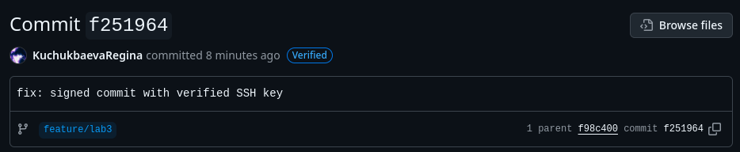

# Lab 3 Submission

## Task 1 - SSH Commit Signature Verification 
### Summary explaining the benefits of signing commits for security:
Commit signing provides cryptographic verification that:
- **Authenticity**: Confirms the commit was made by the claimed author
- **Integrity**: Ensures the commit content hasn't been tampered with
- **Non-repudiation**: Prevents authors from denying their commits

### Evidence of successful SSH key setup and configuration
1. Generated SSH key with:
    ```$ ssh-keygen -t ed25519 -C "a.antipov@innopolis.university"```

2. Configured Git to use SSH signing:
    ```
    $ git config --global gpg.format ssh
    $ git config --global user.signingkey ~/.ssh/id_ed25519.pub
    $ git config --global commit.gpgSign true
    $ nano ~/.ssh/allowed_signers
    $ git config --global gpg.ssh.allowedSignersFile ~/.ssh/allowed_signers
    $ git config --local user.name Lone_Lord
    $ git config --local user.email a.antipov@innopolis.university```


3. Verified signed commit:
    ```
    $ git log --show-signature -1
    commit 53bed4902e33d003c12d07d845163b37469c71e8 (HEAD -> feature/lab3, origin/feature/lab3)
    Good "git" signature for a.antipov@innopolis.university with ED25519 key SHA256:...
    Author: Lone_Lord <a.antipov@innopolis.university>
    Date:   Fri Sep 26 14:52:46 2025 +0300

    checks: check sign```


4. On GitHub the commit appears with the green **Verified** badge.


### Analysis: "Why is commit signing critical in DevSecOps workflows?"
In DevSecOps, security is integrated into every step of the development lifecycle.  
Commit signing is critical because:
- It ensures that only authorized developers contribute code.
- It reduces the risk of supply chain attacks where malicious actors inject code into repositories.
- It enables traceability and accountability of all code changes.
- It provides compliance with security standards and audit requirements.
- In CI/CD pipelines, signed commits guarantee that only verified code is deployed.

### Screenshot of the "Verified" badge on GitHub:

## Task 2 — Pre-commit Secret Scanning

### Pre-commit hook setup process and configuration
```
$ vim .git/hooks/pre-commit
$ echo "AWS_ACCESS_KEY_ID=LoLLoLLoL" > labs/lab3/text.txt
$ git add .
$ git commit -S -m "checks: open secret"


```
### Evidence of successful secret detection blocking commits

```
$ git commit -S -m "checks: open secret"
[pre-commit] scanning staged files for secrets…
[pre-commit] Files to scan: labs/image.png labs/lab3/text.txt labs/submission3.md
[pre-commit] Non-lectures files: labs/image.png labs/lab3/text.txt labs/submission3.md
[pre-commit] Lectures files: none
[pre-commit] TruffleHog scan on non-lectures files…
Unable to find image 'trufflesecurity/trufflehog:latest' locally
docker: Error response from daemon: Get "https://registry-1.docker.io/v2/": dial tcp: lookup registry-1.docker.io on 127.0.0.53:53: read udp 127.0.0.1:45289->127.0.0.53:53: i/o timeout

Run 'docker run --help' for more information
[pre-commit] ✖ TruffleHog detected potential secrets in non-lectures files
[pre-commit] Gitleaks scan on staged files…
[pre-commit] Scanning labs/image.png with Gitleaks...
[pre-commit] No secrets found in labs/image.png
[pre-commit] Scanning labs/lab3/text.txt with Gitleaks...
[pre-commit] No secrets found in labs/lab3/text.txt
[pre-commit] Scanning labs/submission3.md with Gitleaks...
[pre-commit] No secrets found in labs/submission3.md

[pre-commit] === SCAN SUMMARY ===
TruffleHog found secrets in non-lectures files: true
Gitleaks found secrets in non-lectures files: false
Gitleaks found secrets in lectures files: false

✖ COMMIT BLOCKED: Secrets detected in non-excluded files.
Fix or unstage the offending files and try again.
```

### Test results showing both blocked and successful commits

```
$ git commit -S -m "checks: open secret"
[pre-commit] scanning staged files for secrets…
[pre-commit] Files to scan: labs/image.png labs/lab3/text.txt labs/submission3.md
[pre-commit] Non-lectures files: labs/image.png labs/lab3/text.txt labs/submission3.md
[pre-commit] Lectures files: none
[pre-commit] TruffleHog scan on non-lectures files…
Unable to find image 'trufflesecurity/trufflehog:latest' locally
docker: Error response from daemon: Get "https://registry-1.docker.io/v2/": dial tcp: lookup registry-1.docker.io on 127.0.0.53:53: read udp 127.0.0.1:45289->127.0.0.53:53: i/o timeout

Run 'docker run --help' for more information
[pre-commit] ✖ TruffleHog detected potential secrets in non-lectures files
[pre-commit] Gitleaks scan on staged files…
[pre-commit] Scanning labs/image.png with Gitleaks...
[pre-commit] No secrets found in labs/image.png
[pre-commit] Scanning labs/lab3/text.txt with Gitleaks...
[pre-commit] No secrets found in labs/lab3/text.txt
[pre-commit] Scanning labs/submission3.md with Gitleaks...
[pre-commit] No secrets found in labs/submission3.md

[pre-commit] === SCAN SUMMARY ===
TruffleHog found secrets in non-lectures files: true
Gitleaks found secrets in non-lectures files: false
Gitleaks found secrets in lectures files: false

✖ COMMIT BLOCKED: Secrets detected in non-excluded files.
Fix or unstage the offending files and try again.

$ rm labs/lab3/text.txt
$ git add .
$ git commit -S -m "checks: no secret"
[pre-commit] scanning staged files for secrets…
[pre-commit] Files to scan: labs/image.png labs/submission3.md
[pre-commit] Non-lectures files: labs/image.png labs/submission3.md
[pre-commit] Lectures files: none
[pre-commit] TruffleHog scan on non-lectures files…
Unable to find image 'trufflesecurity/trufflehog:latest' locally
docker: Error response from daemon: Head "https://registry-1.docker.io/v2/trufflesecurity/trufflehog/manifests/latest": Get "https://auth.docker.io/token?account=lone1elexus&scope=repository%3Atrufflesecurity%2Ftrufflehog%3Apull&service=registry.docker.io": net/http: TLS handshake timeout

Run 'docker run --help' for more information
[pre-commit] ✖ TruffleHog detected potential secrets in non-lectures files
[pre-commit] Gitleaks scan on staged files…
[pre-commit] Scanning labs/image.png with Gitleaks...
[pre-commit] No secrets found in labs/image.png
[pre-commit] Scanning labs/submission3.md with Gitleaks...
[pre-commit] No secrets found in labs/submission3.md

[pre-commit] === SCAN SUMMARY ===
TruffleHog found secrets in non-lectures files: true
Gitleaks found secrets in non-lectures files: false
Gitleaks found secrets in lectures files: false

✖ COMMIT BLOCKED: Secrets detected in non-excluded files.
Fix or unstage the offending files and try again.
```
 - I need to delete secret from labs/submission3.md
```

