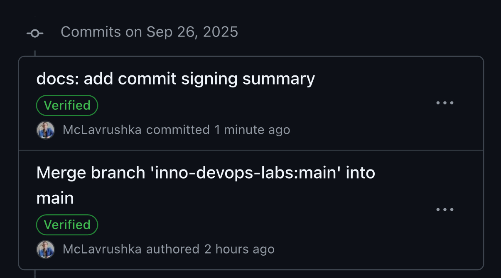

# Lab 3 — Secure Git: Submission

## Task 1 — SSH Commit Signing

### Why signing matters (short summary)

Signed commits guarantee **authenticity** (who authored the change) and **integrity** (the change wasn’t tampered with). In a DevSecOps workflow this “shift-left” control raises trust in the software supply chain, enables repository policies to **require** verified commits, and simplifies audits and incident forensics.

### What I configured

* Generated a new SSH key and added the **public key as a *Signing Key*** in GitHub (not only as an Authentication key).
* Git configuration (Windows host + WSL used for Task 2):

  ```bash
  # Windows Git config (matching my GitHub noreply email)
  git config --global user.name  "EmilGoryachih"
  git config --global user.email "83202732+EmilGoryachih@users.noreply.github.com"
  git config --global gpg.format ssh
  git config --global commit.gpgSign true
  git config --global user.signingkey "C:/Users/emil1/.ssh/id_ed25519"
  git config --global gpg.ssh.allowedSignersFile "C:/Users/emil1/.ssh/allowed_signers"

  # allowed_signers example (single line):
  # 83202732+EmilGoryachih@users.noreply.github.com ssh-ed25519 AAAA...<public-key>...
  ```

### Local evidence

Example output from my machine:

```
Good "git" signature for 83202732+EmilGoryachih@users.noreply.github.com with ED25519 key SHA256:OpJETanLUOhY2c8yhvGb/W1+CESFg8+NaMkmjQqBJkk
```

### GitHub evidence

Insert a screenshot showing the **Verified** badge for a signed commit:





---

## Task 2 — Pre-commit Secret Scanning

### What the hook does

A local Git **pre-commit** hook runs **TruffleHog** and **Gitleaks** via Docker **against staged files only**. If any findings are detected **outside** `lectures/`, the commit is blocked; findings **only** under `lectures/` are printed as a warning and the commit proceeds. This matches the lab instructions to practice pre-commit secret scanning with both tools.

> Note: Git hooks are not versioned by default. I’ve added a copy of the hook to the repo at `labs/tools/pre-commit.sample` for review.

### Hook (portable version used)

```bash
#!/usr/bin/env bash
set -euo pipefail
echo "[pre-commit] scanning staged files for secrets…"

# 1) Collect staged files
mapfile -t STAGED < <(git diff --cached --name-only --diff-filter=ACM)
if [ ${#STAGED[@]} -eq 0 ]; then
  echo "[pre-commit] no staged files; skipping scans"; exit 0; fi

# 2) Only regular files
FILES=()
for f in "${STAGED[@]}"; do [ -f "$f" ] && FILES+=("$f"); done
if [ ${#FILES[@]} -eq 0 ]; then
  echo "[pre-commit] no regular files to scan; skipping"; exit 0; fi

# 3) Root of repo (stable on Windows/WSL/macOS/Linux)
REPO_ROOT=$(git rev-parse --show-toplevel)

# 4) TruffleHog (verified findings only)
echo "[pre-commit] TruffleHog scan…"
if ! docker run --rm -v "${REPO_ROOT}:/repo" -w /repo \
  trufflesecurity/trufflehog:latest \
  filesystem --fail --only-verified "${FILES[@]}"; then
  echo -e "\n✖ TruffleHog detected potential secrets. See output above for details." >&2
  exit 1
fi

# 5) Gitleaks (capture and post-process)
echo "[pre-commit] Gitleaks scan…"
GITLEAKS_OUTPUT=$(docker run --rm -v "${REPO_ROOT}:/repo" -w /repo \
  zricethezav/gitleaks:latest \
  detect --source=/repo --verbose --exit-code=0 --no-banner || true)

echo "$GITLEAKS_OUTPUT"

# 6) Block if there are findings outside lectures/
if echo "$GITLEAKS_OUTPUT" | grep -q "File:"; then
  if echo "$GITLEAKS_OUTPUT" | grep -q "File:.*lectures/"; then
    NON_LECTURES=$(echo "$GITLEAKS_OUTPUT" | grep "File:" | grep -v "lectures/" || true)
    if [ -n "$NON_LECTURES" ]; then
      echo -e "\n✖ Gitleaks detected potential secrets outside lectures/." >&2; exit 1
    else
      echo -e "\n⚠️ Gitleaks found potential secrets only in excluded directories (lectures/)."
    fi
  else
    echo -e "\n✖ Gitleaks detected potential secrets outside lectures/." >&2; exit 1
  fi
fi

echo "✓ No secrets detected; proceeding with commit."
exit 0
```

### Test results (WSL)

* **Negative (shows warning but passes because only `lectures/` has findings):**

  ```
  [pre-commit] TruffleHog scan… (0 verified findings)
  [pre-commit] Gitleaks scan…
  … WRN leaks found: 1 … File: lectures/lec1.md … RuleID: generic-api-key …
  ⚠️ Gitleaks found potential secrets only in excluded directories (lectures/).
  ✓ No secrets detected; proceeding with commit.
  ```
* **Positive (after redacting staged secret):**

  ```
  [pre-commit] TruffleHog scan… (0 findings)
  [pre-commit] Gitleaks scan… (findings only under lectures/)
  ✓ No secrets detected; proceeding with commit.
  ```

*(Optional strict-block demo: add a guaranteed pattern outside `lectures/`, expect “✖ … outside lectures/” and commit blocked; then remove it.)*

---

## Task 3 — PR Template & Checklist

### Template (on `main`)

A concise PR template lives in `.github/pull_request_template.md` on the **`main`** branch of my fork, because GitHub loads templates from the default branch. The template contains **Goal / Changes / Testing** and a 3-item checklist, as requested in the lab.

```markdown
### Goal
<why this PR>

### Changes
<key changes>

### Testing
<how it was tested; links/screens>

- [ ] Clear PR title
- [ ] Docs updated if needed
- [ ] No secrets / large temp files
```

### Evidence

When I opened a PR from `feature/lab3`, the description **auto-filled** with the sections and checklist.

---

## Final Checklist (self-verification)

* [x] At least one commit shows **Verified** on GitHub (SSH signing enabled).
* [x] Local `.git/hooks/pre-commit` runs **TruffleHog + Gitleaks** via Docker and respects the `lectures/` exception; a copy is stored at `labs/tools/pre-commit.sample`.
* [x] `.github/pull_request_template.md` exists on `main` of my fork; a PR from `feature/lab3` to the course repo is opened and the template appears.

**PR URL:** <insert link here>
