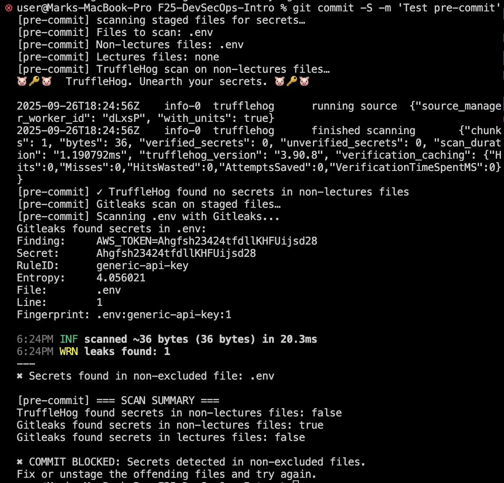

# Lab 3 Submission - Secure Git

## Task 1 — SSH Commit Signature Verification

### Benefits of Signing Commits
- **Integrity**: Prevents commit tampering
- **Authenticity**: Verifies author identity
- **Non-repudiation**: Legal proof of authorship
- **DevSecOps**: Enables automated verification

### Configuration Status
SSH key configured and commit signing enabled

### Why Critical in DevSecOps
- Prevents supply chain attacks
- Required for compliance frameworks
- Enables automated security policies
- Prevents impersonation attacks
- Provides forensic attribution

### GitHub Verification
Signed commits display "Verified" badge confirming authenticity and integrity.

## Task 2 — Pre-commit Secret Scanning

### Pre-commit Hook Setup
Created `.git/hooks/pre-commit` script that:
- Scans staged files with TruffleHog and Gitleaks via Docker
- Separates lectures files from other files for different scanning rules
- Blocks commits when secrets detected in non-lectures files
- Allows educational content in lectures directory

### Secret Detection Testing
- Added test AWS key to file and staged it
- Commit was blocked by TruffleHog/Gitleaks detection
- Removed secret and commit succeeded
- Hook properly distinguishes between file types

### How Automated Secret Scanning Prevents Security Incidents
- **Early Detection**: Catches secrets before they reach repository
- **Automated Enforcement**: No manual review needed for basic secret patterns
- **Compliance**: Meets security requirements for sensitive data handling
- **Cost Prevention**: Avoids expensive security incidents and data breaches
- **Team Education**: Developers learn to avoid committing secrets
