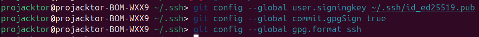
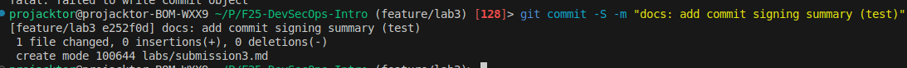

# Task 1

### 1. The benefits of signing commits for security

There are several points of why signign commits using kyes is effective in terms of security:

1. Author's changes verification. The sign totally shows that the author of the commit is a certain human who has it's private key. Commit counterfeit becames much more difficult since the malefactor should has the private key (spoofing protection).

2. Integrity Guarantee. The verification of the commit guarantees that it was not changed. Any changing actions will lead to commit unverification.

3. Non-repudiation. The sign guarantees, the author cannot repudiate from it's changes.

### 2. SSH key setup and configuration

First, I've done the instrucitions provided in the task:

Then, I added the same key into [GitHub keys settings](https://github.com/settings/keys):

Created and pushed a test commit with signing `-S` flag:

Checked that the commit got verification:

### 3. Why is commit signing critical in DevSecOps workflows?

1. Integrating security into the development process. Commit signing ensures security and trust in the codebase from the very first contribution—the commit.

2. Software Supply Chain. Signed commits allow you to trace the origin of your code and ensure that the code in your repository hasn't been tampered with during the push or merge process.

3. Protecting CI/CD pipelines. Configuring pipelines to reject unsigned commits becomes a powerful line of defense.

# Task 2

