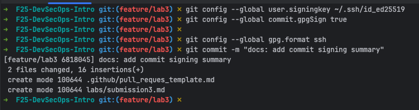
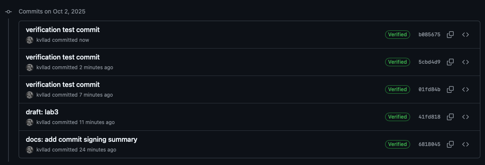
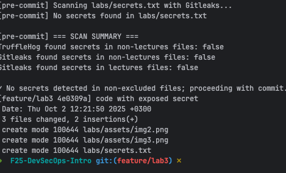

# Lab 3
## vl.kuznetsov@innopolis.university


### Task 1

I already have ssh key

```shell
➜  F25-DevSecOps-Intro git:(feature/lab3) ✗ ls ~/.ssh/                    
config          id_ed25519      id_ed25519.pub  known_hosts     known_hosts.old
```

Configuring ssh signing for git


Why this is necessary:
Signing with ssh guarantees:
 - Authenticity: only the holder of the private key could have created the commit.
 - Integrity – the commit content cannot be changed without breaking the signature.
 - Trust – collaborators and CI/CD systems can automatically confirm the commit really came from you and wasn’t tampered with in transit.

Why is commit signing critical in DevSecOps workflows?:
 - Compliance & auditability – organizations can enforce policies (e.g., “only signed commits allowed on main”) to meet security and regulatory requirements.
 - Supply chain security – signed commits form the foundation of a trusted pipeline, ensuring that artifacts deployed to production can be traced back to verified source commits.

Screenshot of verification badge:



### Task 2


