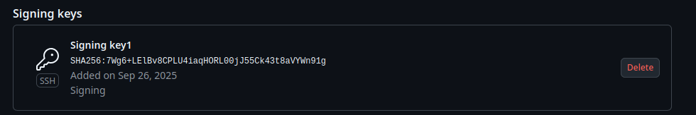

# Task 1

### 1. The benefits of signing commits for security

There are several points of why signign commits using kyes is effective in terms of security:

1. Author's changes verification. The sign totally shows that the author of the commit is a certain human who has it's private key. Commit counterfeit becames much more difficult since the malefactor should has the private key (spoofing protection).

2. Integrity Guarantee. The verification of the commit guarantees that it was not changed. Any changing actions will lead to commit unverification.

3. Non-repudiation. The sign guarantees, the author cannot repudiate from it's changes.

### 2. SSH key setup and configuration

First, I've done the instrucitions provided in the task:


Then, I added the same key into [GitHub keys settings](https://github.com/settings/keys):



Created and pushed a test commit with signing `-S` flag:


Checked that the commit got verification:


### 3. Why is commit signing critical in DevSecOps workflows?

1. Integrating security into the development process. Commit signing ensures security and trust in the codebase from the very first contribution—the commit.

2. Software Supply Chain. Signed commits allow you to trace the origin of your code and ensure that the code in your repository hasn't been tampered with during the push or merge process.

3. Protecting CI/CD pipelines. Configuring pipelines to reject unsigned commits becomes a powerful line of defense.

# Task 2

First we create a pre-commit file in the hidden .git folder:


Give execution permissions


Add sample secret apikey to the files (e.g in current one). I used VirusTotal one:


Test precommit


Prevention for the commiting exists, wonderful


Remove apikey and try againg


Commit has been allowed, here we go, everything works clean


### Analysis of how automated secret scanning prevents security incidents

1. **Early Detection at the Source**
- **Shifts Security Left**: By scanning code before it even enters the repository, secrets are caught at the earliest possible stage — when the developer is most context-aware and fixes are cheapest to implement
- **Prevents Secret Propagation**: Stops sensitive data from ever reaching version control, eliminating the risk of exposure through repository cloning, forking, or public access

2. **Comprehensive Multi-Tool Coverage**
- **Diverse Detection Capabilities**: Using both TruffleHog (specialized in entropy analysis and pattern matching) and Gitleaks (regex-based detection) provides overlapping coverage
- **Reduces False Negatives**: Different tools have varying strengths—TruffleHog excels at finding unstructured secrets while Gitleaks catches pattern-based credentials

3. **Context-Aware Scanning Intelligence**
- **Educational Exception Handling**: The implementation intelligently distinguishes between legitimate educational content (`lectures/` directory) and actual production code
- **Risk-Based Prioritization**: Focuses enforcement on non-lecture files where real secrets would pose actual business risk

4. **Automated Enforcement Mechanism**
- **Mandatory Compliance**: The hook runs automatically on every commit, ensuring consistent application without relying on developer memory or voluntary compliance
- **Immediate Feedback Loop**: Developers receive instant notification of violations with specific file and line-number details, enabling rapid remediation

5. **Incident Prevention Chain**
```
Secret Accidentally Committed → Pre-commit Hook Blocks → Developer Notified → Secret Removed → Incident Prevented
```
Without this control, the chain would continue:
```
Secret Committed → Secret Pushed to Remote → Secret Accessible to Attackers → Credential Abuse → Data Breach
```
