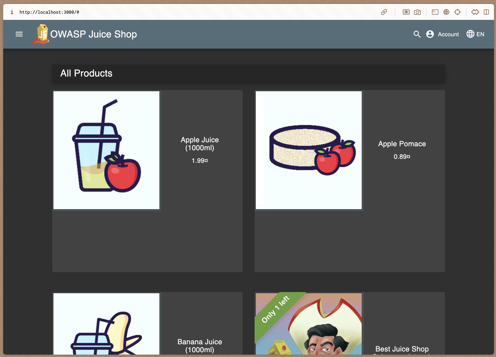

# Lab 3 Submission

## Task 1 - SSH Commit Signature Verification 
### Summary explaining the benefits of signing commits for security:
Commit signing provides cryptographic verification that:
- **Authenticity**: Confirms the commit was made by the claimed author
- **Integrity**: Ensures the commit content hasn't been tampered with
- **Non-repudiation**: Prevents authors from denying their commits

### Evidence of successful SSH key setup and configuration
1. Generated SSH key with:
    ```$ ssh-keygen -t ed25519 -C "a.antipov@innopolis.university"```

2. Configured Git to use SSH signing:
    ```
    $ git config --global gpg.format ssh
    $ git config --global user.signingkey ~/.ssh/id_ed25519.pub
    $ git config --global commit.gpgSign true
    $ nano ~/.ssh/allowed_signers
    $ git config --global gpg.ssh.allowedSignersFile ~/.ssh/allowed_signers
    $ git config --local user.name Lone_Lord
    $ git config --local user.email a.antipov@innopolis.university```


3. Verified signed commit:
    ```
    $ git log --show-signature -1
    commit 53bed4902e33d003c12d07d845163b37469c71e8 (HEAD -> feature/lab3, origin/feature/lab3)
    Good "git" signature for a.antipov@innopolis.university with ED25519 key SHA256:...
    Author: Lone_Lord <a.antipov@innopolis.university>
    Date:   Fri Sep 26 14:52:46 2025 +0300

    checks: check sign```


4. On GitHub the commit appears with the green **Verified** badge.


### Analysis: "Why is commit signing critical in DevSecOps workflows?"
In DevSecOps, security is integrated into every step of the development lifecycle.  
Commit signing is critical because:
- It ensures that only authorized developers contribute code.
- It reduces the risk of supply chain attacks where malicious actors inject code into repositories.
- It enables traceability and accountability of all code changes.
- It provides compliance with security standards and audit requirements.
- In CI/CD pipelines, signed commits guarantee that only verified code is deployed.

### Screenshot of the "Verified" badge on GitHub:

## Task 2 — Pre-commit Secret Scanning

### Pre-commit hook setup process and configuration
```
$ vim .git/hooks/pre-commit
$ vim labs/lab3/test.txt
$ vim labs/lab3/.env
$ vim docker-compose.yml
$ git add .
$ git commit -S -m "checks: open secret, 11 try"
```
### Evidence of successful secret detection blocking commits

```
$ git commit -S -m "checks: open secret, 11 try"
[pre-commit] scanning staged files for secrets…
[pre-commit] Files to scan: labs/lab3/.env
[pre-commit] Non-lectures files: labs/lab3/.env
[pre-commit] Lectures files: none
[pre-commit] TruffleHog scan on non-lectures files…
🐷🔑🐷  TruffleHog. Unearth your secrets. 🐷🔑🐷

2025-09-26T19:17:18Z	info-0	trufflehog	running source	{"source_manager_worker_id": "k22nY", "with_units": true}
Found unverified result 🐷🔑❓
Verification issue: lookup db.example.com on 172.19.0.2:53: no such host
Detector Type: Postgres
Decoder Type: PLAIN
Raw result: ...
Sslmode: <unset>
File: labs/lab3/.env
Line: 5

2025-09-26T19:17:27Z	info-0	trufflehog	finished scanning	{"chunks": 1, "bytes": 336, "verified_secrets": 0, "unverified_secrets": 1, "scan_duration": "10.01785939s", "trufflehog_version": "3.90.8", "verification_caching": {"Hits":0,"Misses":4,"HitsWasted":0,"AttemptsSaved":0,"VerificationTimeSpentMS":14450}}
[pre-commit] ✓ TruffleHog found no secrets in non-lectures files
[pre-commit] Gitleaks scan on staged files…
[pre-commit] Scanning labs/lab3/.env with Gitleaks...
Gitleaks found secrets in labs/lab3/.env:
Finding:     ...
Secret:      ...
RuleID:      stripe-access-token
Entropy:     4.039248
File:        labs/lab3/.env
Line:        6
Fingerprint: ...

7:17PM INF scanned ~336 bytes (336 bytes) in 50.9ms
7:17PM WRN leaks found: 1
---
✖ Secrets found in non-excluded file: labs/lab3/.env

[pre-commit] === SCAN SUMMARY ===
TruffleHog found secrets in non-lectures files: false
Gitleaks found secrets in non-lectures files: true
Gitleaks found secrets in lectures files: false

✖ COMMIT BLOCKED: Secrets detected in non-excluded files.
Fix or unstage the offending files and try again.

```

### Test results showing both blocked and successful commits

```
$ git commit -S -m "checks: open secret"
[pre-commit] scanning staged files for secrets…
[pre-commit] Files to scan: labs/image.png labs/lab3/text.txt labs/submission3.md
[pre-commit] Non-lectures files: labs/image.png labs/lab3/text.txt labs/submission3.md
[pre-commit] Lectures files: none
[pre-commit] TruffleHog scan on non-lectures files…
Unable to find image 'trufflesecurity/trufflehog:latest' locally
docker: Error response from daemon: Get "https://registry-1.docker.io/v2/": dial tcp: lookup registry-1.docker.io on 127.0.0.53:53: read udp 127.0.0.1:45289->127.0.0.53:53: i/o timeout

Run 'docker run --help' for more information
[pre-commit] ✖ TruffleHog detected potential secrets in non-lectures files
[pre-commit] Gitleaks scan on staged files…
[pre-commit] Scanning labs/image.png with Gitleaks...
[pre-commit] No secrets found in labs/image.png
[pre-commit] Scanning labs/lab3/text.txt with Gitleaks...
[pre-commit] No secrets found in labs/lab3/text.txt
[pre-commit] Scanning labs/submission3.md with Gitleaks...
[pre-commit] No secrets found in labs/submission3.md

[pre-commit] === SCAN SUMMARY ===
TruffleHog found secrets in non-lectures files: true
Gitleaks found secrets in non-lectures files: false
Gitleaks found secrets in lectures files: false

✖ COMMIT BLOCKED: Secrets detected in non-excluded files.
Fix or unstage the offending files and try again.

$ rm labs/lab3/text.txt
$ git add .
$ git commit -S -m "checks: no secret"
[pre-commit] scanning staged files for secrets…
[pre-commit] Files to scan: labs/image.png labs/submission3.md
[pre-commit] Non-lectures files: labs/image.png labs/submission3.md
[pre-commit] Lectures files: none
[pre-commit] TruffleHog scan on non-lectures files…
Unable to find image 'trufflesecurity/trufflehog:latest' locally
docker: Error response from daemon: Head "https://registry-1.docker.io/v2/trufflesecurity/trufflehog/manifests/latest": Get "https://auth.docker.io/token?account=lone1elexus&scope=repository%3Atrufflesecurity%2Ftrufflehog%3Apull&service=registry.docker.io": net/http: TLS handshake timeout

Run 'docker run --help' for more information
[pre-commit] ✖ TruffleHog detected potential secrets in non-lectures files
[pre-commit] Gitleaks scan on staged files…
[pre-commit] Scanning labs/image.png with Gitleaks...
[pre-commit] No secrets found in labs/image.png
[pre-commit] Scanning labs/submission3.md with Gitleaks...
[pre-commit] No secrets found in labs/submission3.md

[pre-commit] === SCAN SUMMARY ===
TruffleHog found secrets in non-lectures files: true
Gitleaks found secrets in non-lectures files: false
Gitleaks found secrets in lectures files: false

✖ COMMIT BLOCKED: Secrets detected in non-excluded files.
Fix or unstage the offending files and try again.

$ rm labs/lab3/test.txt
$ rm labs/lab3/.env
$ rm docker-compose.yml
$ git commit -S -m "checks: no secret"
[pre-commit] scanning staged files for secrets…
[pre-commit] no staged files; skipping scans
[feature/lab3 5eb7c7c] checks: no secret
 3 files changed, 11 deletions(-)
 delete mode 100644 docker-compose.yml
 delete mode 100644 labs/lab3/.env
 delete mode 100644 labs/lab3/test.txt
$ vim labs/lab3/test.txt
$ git commit -S -m "checks: no secret, extra file"
[pre-commit] scanning staged files for secrets…
[pre-commit] Files to scan: labs/lab3/test.txt labs/submission3.md
[pre-commit] Non-lectures files: labs/lab3/test.txt labs/submission3.md
[pre-commit] Lectures files: none
[pre-commit] TruffleHog scan on non-lectures files…
🐷🔑🐷  TruffleHog. Unearth your secrets. 🐷🔑🐷

2025-09-26T19:23:59Z	info-0	trufflehog	running source	{"source_manager_worker_id": "LKfSr", "with_units": true}
Found unverified result 🐷🔑❓
Verification issue: lookup db.example.com on 172.19.0.2:53: no such host
Detector Type: Postgres
Decoder Type: PLAIN
Raw result: ...
Sslmode: <unset>
File: labs/submission3.md
Line: 77

2025-09-26T19:24:05Z	info-0	trufflehog	finished scanning	{"chunks": 2, "bytes": 7647, "verified_secrets": 0, "unverified_secrets": 1, "scan_duration": "5.908860573s", "trufflehog_version": "3.90.8", "verification_caching": {"Hits":0,"Misses":2,"HitsWasted":0,"AttemptsSaved":0,"VerificationTimeSpentMS":6281}}
[pre-commit] ✓ TruffleHog found no secrets in non-lectures files
[pre-commit] Gitleaks scan on staged files…
[pre-commit] Scanning labs/lab3/test.txt with Gitleaks...
[pre-commit] No secrets found in labs/lab3/test.txt
[pre-commit] Scanning labs/submission3.md with Gitleaks...
Gitleaks found secrets in labs/submission3.md:
7:24PM INF scanned ~7645 bytes (7.64 KB) in 64.9ms
7:24PM WRN leaks found: 2
Finding:     ...inding:     ...
Secret:      ...
RuleID:      stripe-access-token
Entropy:     4.039248
File:        labs/submission3.md
Line:        87
Fingerprint: labs/submission3.md:stripe-access-token:87

Finding:     Secret:      ...
Secret:      ...
RuleID:      stripe-access-token
Entropy:     4.039248
File:        labs/submission3.md
Line:        88
Fingerprint: ...
---
✖ Secrets found in non-excluded file: labs/submission3.md

[pre-commit] === SCAN SUMMARY ===
TruffleHog found secrets in non-lectures files: false
Gitleaks found secrets in non-lectures files: true
Gitleaks found secrets in lectures files: false

✖ COMMIT BLOCKED: Secrets detected in non-excluded files.
Fix or unstage the offending files and try again.
```
I need to remove secrets from submission3.md file.
```
lord@EmptyThrone:~/DevSexOps$ git add .
lord@EmptyThrone:~/DevSexOps$ git commit -S -m "checks: no secret, change submission file"
[pre-commit] scanning staged files for secrets…
[pre-commit] Files to scan: labs/lab3/test.txt labs/submission3.md
[pre-commit] Non-lectures files: labs/lab3/test.txt labs/submission3.md
[pre-commit] Lectures files: none
[pre-commit] TruffleHog scan on non-lectures files…
🐷🔑🐷  TruffleHog. Unearth your secrets. 🐷🔑🐷

2025-09-26T19:31:54Z	info-0	trufflehog	running source	{"source_manager_worker_id": "x5KxR", "with_units": true}
2025-09-26T19:31:54Z	info-0	trufflehog	finished scanning	{"chunks": 2, "bytes": 9709, "verified_secrets": 0, "unverified_secrets": 0, "scan_duration": "4.871744ms", "trufflehog_version": "3.90.8", "verification_caching": {"Hits":0,"Misses":0,"HitsWasted":0,"AttemptsSaved":0,"VerificationTimeSpentMS":0}}
[pre-commit] ✓ TruffleHog found no secrets in non-lectures files
[pre-commit] Gitleaks scan on staged files…
[pre-commit] Scanning labs/lab3/test.txt with Gitleaks...
[pre-commit] No secrets found in labs/lab3/test.txt
[pre-commit] Scanning labs/submission3.md with Gitleaks...
[pre-commit] No secrets found in labs/submission3.md

[pre-commit] === SCAN SUMMARY ===
TruffleHog found secrets in non-lectures files: false
Gitleaks found secrets in non-lectures files: false
Gitleaks found secrets in lectures files: false

✓ No secrets detected in non-excluded files; proceeding with commit.
[feature/lab3 1d166c3] checks: no secret, change submission file
 2 files changed, 105 insertions(+), 21 deletions(-)
 create mode 100644 labs/lab3/test.txt
```
### Analysis of how automated secret scanning prevents security incidents

Automated secret scanning stops sensitive data like API keys or passwords from being committed to Git. This prevents accidental leaks into repositories, where attackers could exploit them. By detecting issues early, it reduces security risks and enforces safer development practices.